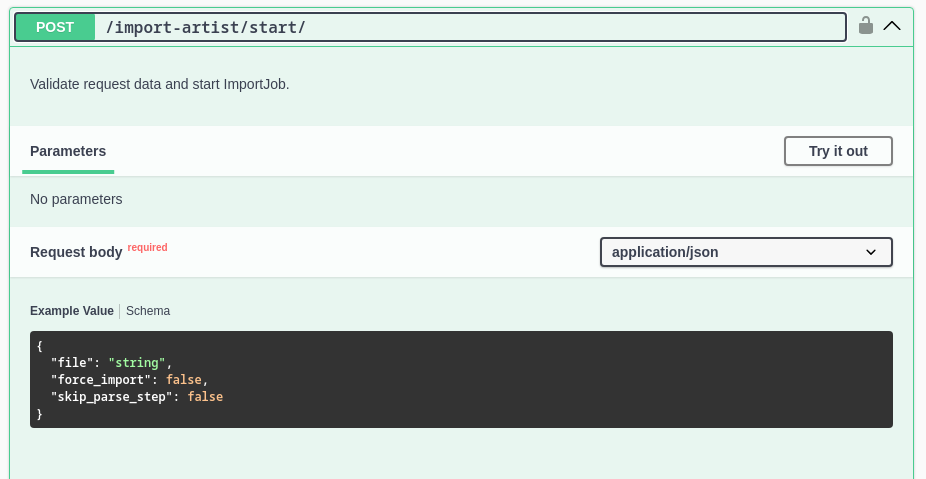

# Extensions

This package is an extension of the original `django-import-export`, so for more information
on the import/export process and advanced resource usage, refer
[the official django-import-export documentation](https://django-import-export.readthedocs.io/en/latest/index.html).

The following section describes the features added by this package.

## ImportJob/ExportJob models

`django-import-export-extensions` provides the `ImportJob` and `ExportJob` models to store all
information related to the import/export process. Additionally, these models are involved
in the background import/export tasks.

The job models are already registered in Django Admin and come with custom forms that display all
relevant job information, including the current import/export status.


`ImportJob`/`ExportJob` models contain useful properties and methods for managing
the import/export process. To learn more, see the [Models API documentation](reference/models.md).

## Celery admin mixins

The admin mixins have been completely rewritten, although they still inherit from the base mixins:
`mixins.BaseImportMixin`, `mixins.BaseExportMixin`, and `admin.ImportExportMixinBase`.
The new Celery admin mixins add pages for displaying import/export status and use custom templates
for both the status and results pages.

After starting the import/export process, you will be redirected to the status page.
Once the import/export is complete, you will then be redirected to the results page.


## ViewSets

The `ImportJobViewSet` and `ExportJobViewSet` viewsets make it easy to implement
import/export functionality via API. To use them, simply create a custom class
and set the `resource_class` attribute:

```python title="api/views.py"
from import_export_extensions.api import views as import_export_views
from . import resources


class BandImportViewSet(import_export_views.ImportJobViewSet):
    resource_class = resources.BandResource


class BandExportViewSet(import_export_views.ExportJobViewSet):
    resource_class = resources.BandResource
```

```python title="api/urls.py"
from rest_framework.routers import DefaultRouter
from .api import views

band_import_export_router = DefaultRouter()
band_import_export_router.register(
    "import-band",
    views.BandImportViewSet,
    basename="import-band",
)
band_import_export_router.register(
    "export-band",
    views.BandExportViewSet,
    basename="export-band",
)

urlpatterns = band_import_export_router.urls
```

By default, all import/export jobs for the set `resource_class` will be available,
but you can override the `get_queryset` method to customize this behavior. Additionally, you can
override the `get_resource_kwargs` method to provide custom values in the resource class
(e.g., for the start action).

These viewsets provide all the methods required for the full import/export workflow: start, details,
confirm, cancel, and list actions. There is also integration with
[drf-spectacular](https://github.com/tfranzel/drf-spectacular). If you have it installed,
you can view the generated OpenAPI UI for these viewsets.


## Filters

The `CeleryResource` and `CeleryModelResource` classes also support
[django-filter](https://django-filter.readthedocs.io/) to filter the queryset for export.
To use this feature, set the `filterset_class` attribute on your resource class and pass
filter parameters as the `filter_kwargs` argument to the resource:

```python title="api/filters.py"
from django_filters import rest_framework as filters

from . import models


class BandFilterSet(filters.FilterSet):

    class Meta:
        model = models.Band
        fields = [
            "id",
            "title",
        ]
```

```python title="resources.py"
from import_export_extensions import resources
from . import filters
from . import models


class BandResource(resources.CeleryModelResource):

    filterset_class = filters.BandFilterSet

    class Meta:
        model = models.Band
        fields = [
            "id",
            "title",
        ]
```

If `filterset_class` is set for your resource, you can pass `filter_kwargs` to filter export
queryset:

```python
>>> from .resources import BandResource
>>> from .models import Band
>>> Band.objects.bulk_create([Band(title=title) for title in "ABC"])
>>> BandResource().get_queryset().count()
3
>>> filter_kwargs = {"title": "A"}
>>> band_resource_with_filters = BandResource(filter_kwargs=filter_kwargs)
>>> band_resource_with_filters.get_queryset().count()
1
```

Pass `filter_kwargs` in `resource_kwargs` argument to create `ExportJob` with filtered queryset:

```python
>>> export_job = ExportJob.objects.create(
        resource_path=BandResource.class_path,
        file_format_path=file_format_path,
        resource_kwargs={"filter_kwargs": filter_kwargs},
    )
>>> export_job.refresh_from_db()
>>> len(export_job.result)
1
```

Since we are using the Django REST Framework filter set, the `ExportJobViewSet` also supports it.
It automatically uses the filter set defined in the `resource_class`. You can see that the start
action expects query parameters for filtering:


## Force import

This package includes a "force import" feature. When enabled, rows with errors will be skipped,
and the remaining rows will be processed.

### Admin page

This functionality available in admin:


If any rows contain errors, they will be reported during the parse/import stage:


### API

In the API, there are two additional fields: `force_import` and `skip_parse_step`.

* `force_import` - Allows you to skip rows with errors.

* `skip_parse_step` - Enables you to run the import task immediately, without needing to call the `confirm` endpoint.



## Widgets

This package also provides additional widgets for some types of data.

### FileWidget

Working with file fields is a common task. The `FileWidget` allows you to import/export files,
including links to external resources, and saves via picked `STORAGE`.
This widget loads a file from a URL into the media directory and correctly renders the link
for export. It also supports the `AWS_STORAGE_BUCKET_NAME` setting.

### IntermediateManyToManyWidget

`IntermediateManyToManyWidget` allows to import/export objects with related items.
Default M2M widget store just IDs of related objects. With intermediate widget
additional data may be stored. Should be used with `IntermediateManyToManyField`.

The `IntermediateManyToManyWidget` is an advanced widget that allows you to import/export objects
with related items in a Many-to-Many relationship, while also supporting additional data beyond
just the relationship IDs. Unlike the default M2M widget, which only stores the IDs of related
objects, the `IntermediateManyToManyWidget` enables you to store additional information for each
related object, making it more flexible for use cases where extra attributes or fields need
to be saved alongside the relationship.

This widget is designed to be used with the `IntermediateManyToManyField` in your model.

Usage:

```python title="resources.py"
class ArtistResourceWithM2M(CeleryModelResource):
    """Artist resource with Many2Many field."""

    bands = IntermediateManyToManyField(
        attribute="bands",
        column_name="Bands he played in",
        widget=IntermediateManyToManyWidget(
            rem_model=Band,
            rem_field="title",
            extra_fields=["date_joined"],
            instance_separator=";",
        ),
    )

    class Meta:
        model = Artist
        clean_model_instances = True
        fields = [
            "id",
            "name",
            "bands",
            "instrument",
        ]

    def get_queryset(self):
        """Reduce DB queries number."""
        return Artist.objects.all().prefetch_related(
            "membership_set__band",
            "bands",
        )
```

### Result (result.xlsx)

| id | name           | Bands he played in                               | instrument |
|----|----------------|--------------------------------------------------|------------|
| 1  | Rachel Schmidt | Walter-Hodges:1971-09-22;Ortiz-Hughes:2018-02-02 | 1          |

## Fields

### IntermediateManyToManyField

This is resource field for M2M with custom `through` model.

By default, `django-import-export` set up object attributes using
`setattr(obj, attribute_name, value)`, where `value` is `QuerySet`
of related model objects. But django forbid this when `ManyToManyField`
used with custom `through` model.

This field expects be used with custom `IntermediateManyToManyWidget` widget
that return not simple value, but dict with intermediate model attributes.
