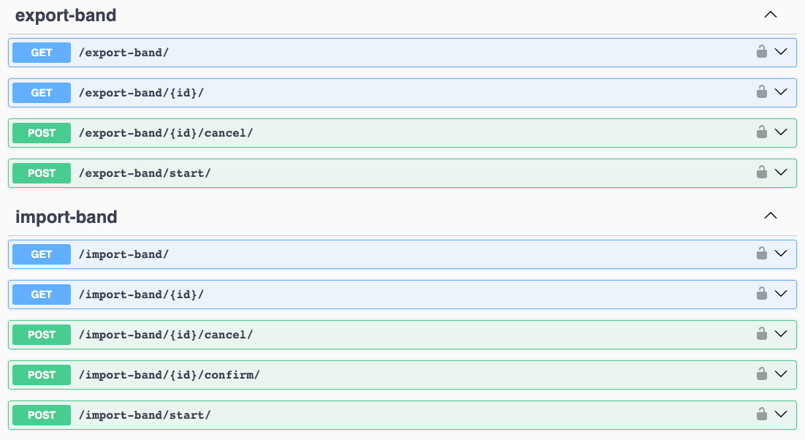

===============
Getting started
===============

``django-import-export-extensions`` is based on ``django-import-export`` package so it have similar
workflow and interfaces. If you already worked with original one,
you can check :ref:`Migrate from original django-import-export package<Migrate from original \`django-import-export\` package>`
section to start using background import/export.

You can also read the `django-import-export documentation <https://django-import-export.readthedocs.io/en/latest/index.html>`_
to learn how to work with import and export.

There are simple examples to quickly get import/export functionality.

Test app model
--------------

Here is simple django model from test app that we gonna use in the examples above.

.. code-block:: python

    from django.db import models

    class Band(models.Model):

        title = models.CharField(
            max_length=100,
        )

        class Meta:
            verbose_name = _("Band")
            verbose_name_plural = _("Bands")

        def __str__(self) -> str:
            return self.title

Resources
---------

The resource class is a core of import/export. This is similar to forms in Django, but
provides methods for converting data from a file to objects and vice versa.

``django-import-export-extensions`` provides ``CeleryResource`` and ``CeleryModelResource`` classes. Here
is an example of simple model resource

.. code-block:: python

    from import_export_extensions.resources import CeleryModelResource

    class BandResource(CeleryModelResource):
        """Resource for `Band` model."""

        class Meta:
            model = Band
            fields = [
                "id",
                "title",
            ]

This resource already allows you to import/export bands the same as original package. But to start
importing/exporting in background it's necessary to create ``ImportJob``/``ExportJob`` objects.

Resource classes just modified to interact with celery, but workflow is the same. So if you want to
know more, read `Resources <https://django-import-export.readthedocs.io/en/latest/api_resources.html>`_ and
`Import data workflow <https://django-import-export.readthedocs.io/en/latest/import_workflow.html#>`_
sections of base package documentation.

Job models
----------

Package provides ``ImportJob``/``ExportJob`` that are core of background import/export. This models
stores parameters and result of import/export. Once you create an instance of the class,
the celery task will be started and the import/export process will begin.

Example of creation:

.. code-block:: python

    from import_export_extensions import models
    from . import resources

    file_format_path = "import_export.formats.base_formats.CSV"
    import_file = "files/import_file.csv"

    # Start import job
    import_job = models.ImportJob.objects.create(
        resource_path=resources.BandResource.class_path,
        data_file=import_file,
        resource_kwargs={},
    )

    # Start export job
    export_job = models.ExportJob.objects.create(
        resource_path=resources.BandResource.class_path,
        file_format_path=file_format_path,
        resource_kwargs={}
    )

    print(import_job.import_status, export_job.export_status)  # CREATED, CREATED

These models are also registered in Django Admin, so you can see all information about created
jobs there.

Admin models
------------

To import/export using celery via Django Admin, use ``CeleryImportExportMixin``
for your admin model and set ``resource_class`` class attribute

.. code-block:: python

    from import_export_extensions.admin import CeleryImportExportMixin
    from . import resources
    from . import models

    @admin.register(models.Band)
    class BandAdmin(CeleryImportExportMixin, admin.ModelAdmin):
        """Admin for `Band` model with import export functionality."""
        list_display = (
            "title",
        )
        resource_classes = [resources.BandResource]

There are also ``CeleryImportAdminMixin`` and ``CeleryExportAdminMixin`` available if you need
only one operation in admin. All of these mixins add ``status`` page to check the progress of
import/export:

.. figure:: _static/images/export-status.png

   A screenshot of Djagno Admin export status page

Import/Export API
-----------------

``api.views.ExportJobViewSet`` and ``api.views.ImportJobViewSet`` are provided to create appropriate
viewsets for the resource

.. code-block:: python

    from import_export_extensions.api import views
    from . import resources

    class BandExportViewSet(views.ExportJobViewSet):
        """Simple ViewSet for exporting `Band` model."""
        resource_class = resources.BandResource

    class BandImportViewSet(views.ImportJobViewSet):
        """Simple ViewSet for importing `Band` model."""
        resource_class = resources.BandResource

These viewsets provide the following actions to manage ``ImportJob``/``ExportJob`` objects:

* ``list`` - returns list of jobs for `resource_class` set in ViewSet
* ``retrieve`` - returns details of job for passed ID
* ``start`` - creates job object and starts import/export
* ``cancel`` - stops import/export and set ``CANCELLED`` status for job
* ``confirm`` - confirms importing after parse stage. Only ``ImportJobViewSet`` has this action.

There is also ``drf_spectacular`` integration so if you have this package configured the openapi
spec will be available.

   A screenshot of a generated openapi spec
